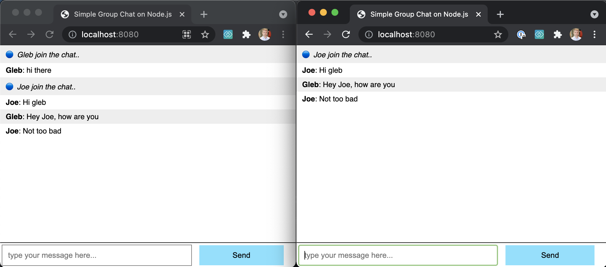

# cypress-workshop-socketio-chat
> Testing Socketio chat app using Cypres.io



## Install

Using Node v12+ install dependencies

```shell
$ npm install
```

## Run chat server

```shell
$ npm start
```

Open `localhost:8080`
